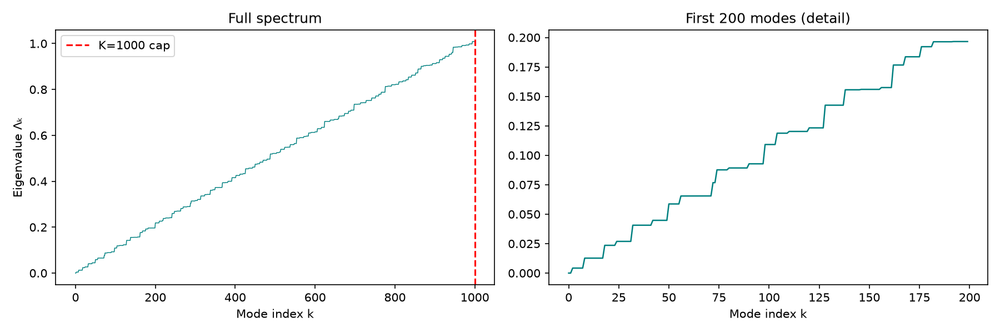
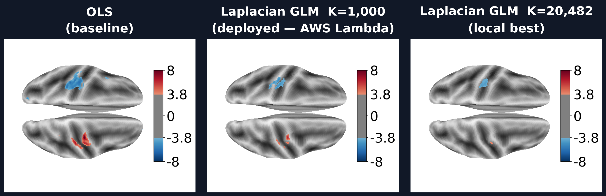

# Cortical Surface Informed Laplacian Regularized GLM for First-Level fMRI Estimation

**Nelson Torres** — Research Advisor: Dr. Xin Yang — August 2026

An interactive simulation of the method is available at **[nelsontorresjr330.github.io/research/laplacian-glm](https://nelsontorresjr330.github.io/research/laplacian-glm)**.

---

## Overview

This folder contains all code for the paper *Cortical Surface Informed Laplacian Regularized GLM for First-Level fMRI Estimation*. The method adds a graph Laplacian penalty to the standard OLS GLM objective, solved in closed form via the spectral decomposition of the cortical surface mesh. Evaluated across three independent task-fMRI datasets using four complementary metrics, it achieves a **+20.85% combined improvement** over the OLS baseline (and up to +50.0% at full eigenbasis).

---

## Directory Structure

```
research/
├── README.md
├── cloudformation.yaml          # AWS infrastructure (API Gateway + Lambda + S3)
├── lambda/
│   ├── handler.py               # AWS Lambda function (deployed simulation)
│   └── Dockerfile               # Container image for Lambda
├── scripts/
│   ├── core_glm.py              # Core algorithm: OLS, regularized fit, evaluation metrics
│   ├── prep_data.py             # Prepare single-dataset eigenbasis + BOLD matrix
│   ├── prep_multi.py            # Prepare all three datasets for multi-dataset search
│   ├── recompute_eigenvectors.py # Recompute eigenbasis at a different K or resolution
│   ├── param_search_multi.py    # Bayesian hyperparameter search (Optuna TPE, multi-dataset)
│   ├── k_sensitivity.py         # Sweep K from 20 → 20,482; compute combined score at each
│   ├── generate_visualizations.py # Produce the 3-panel activation map figure (paper Fig. 6)
│   ├── upload_multi.py          # Upload prepared data to S3 for Lambda access
│   ├── build_layer.sh           # Build Lambda dependency layer (legacy zip deploy)
│   ├── deploy_lambda.sh         # Deploy via zip + layer (legacy)
│   └── deploy_container.sh      # Build + push Docker image; deploy Lambda via CloudFormation
└── results/
    ├── k_sensitivity.json       # K sweep results: combined score at every K (step 20)
    ├── activation_comparison.png # Fig. 6: OLS vs K=1,000 vs K=20,482 activation maps
    └── eigenvalue_spectrum.png  # Laplacian eigenvalue spectrum plot
```

> **Data directories** (`local_data/`, `local_data_multi/`) are excluded from git — they contain large NumPy arrays. Generate them with the prep scripts below.

---

## Requirements

```bash
pip install numpy scipy matplotlib Pillow nilearn nibabel optuna boto3
```

Python 3.10+ recommended. AWS CLI and Docker are required only for deployment.

---

## Reproducing the Results

All scripts are run from the **repo root** (one level above `research/`).

### 1 — Prepare the data

```bash
# Build eigenbasis (Laplacian L, evals, evecs) + project one dataset onto fsaverage5
python research/scripts/prep_data.py

# Prepare all three datasets for multi-dataset evaluation
python research/scripts/prep_multi.py
```

Outputs written to `local_data/` and `local_data_multi/{localizer,spm_auditory,spm_multimodal}/`.

### 2 — Hyperparameter search

```bash
python research/scripts/param_search_multi.py \
    --eigenbasis-dir ./local_data \
    --datasets-dir   ./local_data_multi \
    --out            search_results.json
```

Runs Bayesian TPE search (Optuna) over λ ∈ [0.05, 3.00], K ∈ [50, 1000], p ∈ [10⁻⁵, 0.05], cluster ∈ [5, 20]. Press Ctrl+C to stop; results are saved incrementally. Reported optimum: **λ\* = 2.66, K\* = 1,000, p\* = 6.5×10⁻⁵, cluster\* = 19**.

### 3 — K sensitivity sweep

```bash
python research/scripts/k_sensitivity.py \
    --eigenbasis-dir ./local_data \
    --datasets-dir   ./local_data_multi \
    --out            research/results/k_sensitivity.json
```

Sweeps K from 20 to 20,482 (step 20) at fixed λ\* = 2.66. Results already included in `results/k_sensitivity.json`.

### 4 — Generate activation map figure

```bash
python research/scripts/generate_visualizations.py \
    --eigenbasis-dir ./local_data \
    --dataset-dir    ./local_data_multi/localizer \
    --contrast       "(left - right) button press" \
    --out            research/results/activation_comparison.png
```

Produces the three-panel OLS / K=1,000 / K=20,482 surface map figure (paper Fig. 6).

---

## AWS Deployment

The online simulation is deployed as a containerized AWS Lambda behind API Gateway.

```bash
# One-time infrastructure setup
aws cloudformation deploy \
    --template-file research/cloudformation.yaml \
    --stack-name laplacian-glm \
    --capabilities CAPABILITY_NAMED_IAM

# Upload precomputed data to S3
python research/scripts/upload_multi.py --bucket laplacian-glm-data

# Build container image and deploy Lambda
bash research/scripts/deploy_container.sh
```

The Lambda runs with 2 GB memory and a 29-second API Gateway timeout, capping K at 1,000.

---

## Key Files

| File | Purpose |
|---|---|
| `scripts/core_glm.py` | `fit_ols`, `fit_regularized`, `contrast_zscore`, `_sig_mask`, `_evaluate`, `compute_score` |
| `lambda/handler.py` | Async Lambda handler; loads eigenbasis from S3, fits both models, renders brain maps |
| `results/k_sensitivity.json` | 1,025 (K, combined_score) pairs used for the K sensitivity figure |

---

## Results

**K sensitivity — combined score vs. number of retained eigenmodes:**



**Activation maps — OLS vs. K=1,000 (deployed) vs. K=20,482 (local best):**


